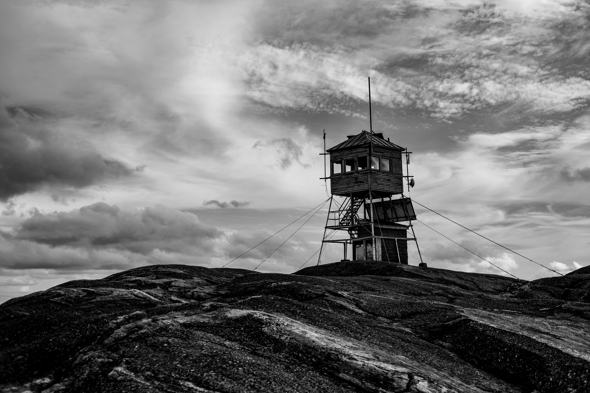
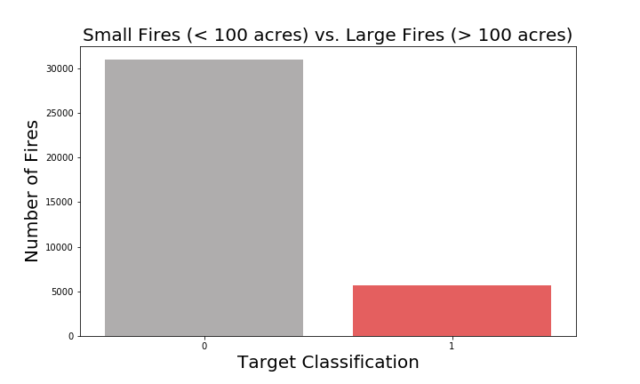
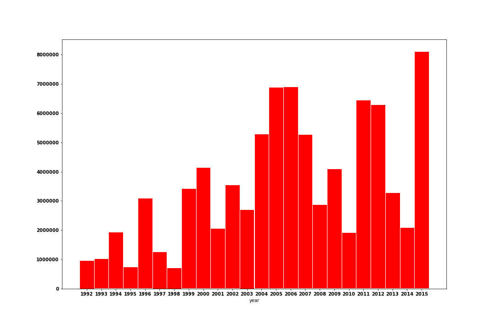
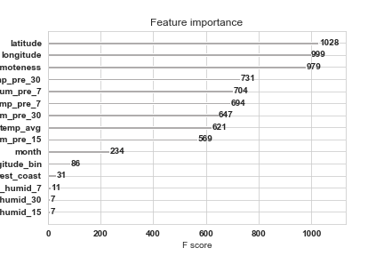

# Forst Fire Classification

**Author**: [Justin Fernandez](mailto:justin_miguel_fernandez@gmail.com), [David Bruce](mailto:david.bruce14@gmail.com)

## Problem Overview
Wildfires are highly unpredictable natural disasters. They can be sparked by a variety of factors (human carelessness, arson, lightning, etc.), and spread and behave differently based on a myriad of different “ingredients.” All wildfires start small, but any one of these risk factors can change at a moment’s notice taking a fire from small and almost contained, to unwieldy and catastrophic. The effects of global climate change have only exacerbated the factors we know to be conducive to large wildfires, namely heat, drought, and high winds. While wildfires can occur almost anywhere at any time, there are certainly circumstances that make a wildfire more threatening.

## The Data
The [dataset](https://www.kaggle.com/capcloudcoder/us-wildfire-data-plus-other-attributes) was compiled on Kaggle from the Fort Collins, CO: Forest Service Research Data Archive about wildfires across the US (& PR) from 1992 - 2015, NOAA National Centers for Environmental Information, and supplemented from two other sources. **We wanted to create a highly interpretable, predictive model to help firefighters classify wildfires from less dangerous to more dangerous (small or large).** The National Wildfire Coordinating Group (NWCG) uses a retroactive [classification metric](https://www.nwcg.gov/term/glossary/size-class-of-fire#:~:text=As%20to%20size%20of%20wildfire,one%2Dfourth%20acre%20or%20less%3B&text=Class%20F%20%2D%201%2C000%20acres%20or,G%20%2D%205%2C000%20acres%20or%20more) of "A-G" where "A" is the smallest category burning anything under ¼ of an acre, and "G" being the largest class of fires burning a *minimum* of 5,000 acres. 

The dataset includes features about what caused a fire, weather conditions leading up to the start of the fire, and geographical data about the type of environment most prevalent at the site of a fire. If firefighters are able to forecast a fire's potential to become "large" based on these factors and a few that we engineered from the data, they will be able to make faster prioritizations and real-time decisions about where and when to allocate their limited resources.

## Modeling

## Conclusions & Next Steps

### Further Research

 

### Navigation
- `final_notebook.ipynb`: Final notebook containing complete anlysis and modeling
- `EDA_FE_notebook.ipynb`: Exploratory data analysis and feature engineering
- `modeling.ipynb`: Classification modeling for prediction of fire size
- `data`: Folder containing data using in repository
- `images`: Folder containing images used in repository
